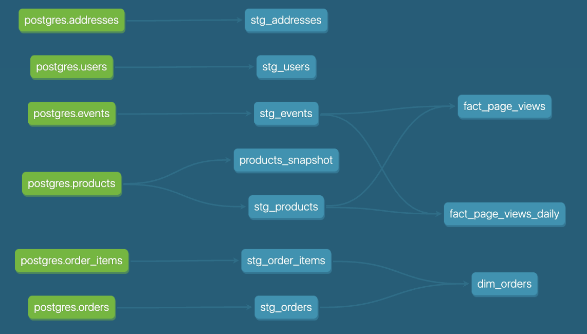

## Week Two Project Questions

### Part 1. Models

**1. What is our user repeat rate?

Repeat Rate = Users who purchased 2 or more times / users who purchased**

The Repeat rate of our users is 79.8%.

Found using this query:
```
WITH user_purchase_counts AS (
    SELECT
        USER_ID,
        CASE
            WHEN COUNT(ORDER_ID) = 1 THEN '1 order'
            ELSE '2 or more orders'
        END AS ORDER_COUNT_CATEGORY
    FROM DEV_DB.DBT_TJHODGES12GMAILCOM.STG_ORDERS
    GROUP BY USER_ID
)

SELECT
    SUM(CASE WHEN ORDER_COUNT_CATEGORY = '2 or more orders' THEN 1 ELSE 0 END) * 100.0 / COUNT(USER_ID) AS RETURN_RATE
FROM user_purchase_counts;
```

**2. What are good indicators of a user who will likely purchase again? What about indicators of users who are likely NOT to purchase again? If you had more data, what features would you want to look into to answer this question?**

Good indicators of a user who will likely purchase again could be:
- high number of previous purchases
- high number and high total length of browsing sessions since last purchase
- positive reviews left on review sites
- low number of previous returns

Good indicators of a user who will likely not purchase again could be:
- low number and low total length of browsing sessions since last purchase
- negative reviews left on review sites
- high number of previous returns

If I had more data, potential features I would look into:
- boolen, if person left a review
- sentiment of review
- number of browising sessions since last purchase
- total length of browsing sessions since last purchase
- number of returns

**3. Explain the product mart models you added. Why did you organize the models in the way you did?**

I created two fact tables related to page views:
- fact_page_views
- fact_page_views_daily

In fact_page_views, I filtered the events table to page views, and removed unneeded columns.
In fact_page_views_daily, I calculate daily views for each page.

I organized these separately so Product team members can have easy access to both the granular page view event data if they want to drill deeply into page view data, and daily metrics around page views for tracking trends.

If I were to continue building out, I may add more separate models for different product related events or metrics.

**4. Explain the core mart models you added. Why did you organize the models in the way you did?**

I created one dim table, dim_orders, in the core mart. This table joins in information about product IDs and quantities in each order to the raw orders table.

I created this table in core, as many business groups may want to leverage information about orders.

**5. Use the dbt docs to visualize your model DAGs to ensure the model layers make sense**



## Part 2. Tests

**1.What assumptions are you making about each model? (i.e. why are you adding each test?)**

For my staging models, I added checks to make sure every primary key has no nulls and is unique. This is because otherwise, our tables do not have properly defined primary keys and can result in all types of problems for downstream users who are counting on the primary key representing unique observations in the dataset!

As well, I added a few relationship tests to make sure tables referencing an ID from the "source of truth" table were using valid ID:
- test that 'stg_events' uses `user_id` values that are found in 'stg_users'
- test that 'stg_orders' uses `address_id` values that are found in 'stg_addresses'
- test that 'stg_order_items' uses `order_id` values that are found in 'stg_orders'

I also added one singluar test for model 'stg_orders' to test that for orders that have been delivered, the delivery date is after the order creation date.

For my new dimension and fact tables, I also checked for non-null and unique primary keys. I used the 'dbt_utils_unique_combination_of_columns' test
on the 'fact_page_views_daily' model to test the unique combinatio of two models that make up the primary key.

As well, I tested that 'fact_page_views_daily' only has positive numbers of views recorded.

**2. Did you find any “bad” data as you added and ran tests on your models? How did you go about either cleaning the data in the dbt model or adjusting your assumptions/tests?**

All my tests passed without needing to make any changes to how the data is processed. Given the leading nature of this question, I imagine there may be some "bad" data lurking that more rigorous tests would find!


## Part 3. dbt snapshots

The following `product_id`s had changing values:

```
4cda01b9-62e2-46c5-830f-b7f262a58fb1
55c6a062-5f4a-4a8b-a8e5-05ea5e6715a3
be49171b-9f72-4fc9-bf7a-9a52e259836b
fb0e8be7-5ac4-4a76-a1fa-2cc4bf0b2d80
```

Found using this query:
```
SELECT DISTINCT PRODUCT_ID
FROM DEV_DB.DBT_TJHODGES12GMAILCOM.PRODUCTS_SNAPSHOT
WHERE DBT_VALID_TO IS NOT NULL
```

NOTE: This query will work this time where we've only had one change of data, but I'll need to update it for future times when we've had multiple changes per product id.